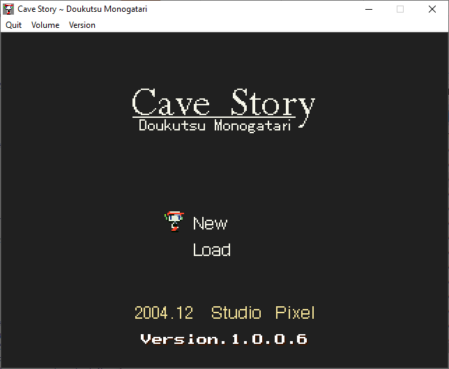

[](https://travis-ci.com/Clownacy/CSE2)

## Table of Contents

This repo has two main branches:

Branch | Description
--------|--------
[accurate](https://www.github.com/Clownacy/CSE2/tree/accurate) | The main decompilation branch. The code is intended to be as close to the original as possible, down to all the bugs and platform-dependencies.
[portable](https://www.github.com/Clownacy/CSE2/tree/portable) | This branch ports the engine away from WinAPI and DirectX, and addresses numerous portability issues, allowing it to run on other platforms.

# CSE2

CSE2 is a decompilation of Cave Story.



## Background

When Pixel made Cave Story, he compiled the original Windows EXE with no
optimisations. This left the generated assembly code extremely verbose and easy
to read. It also made the code very decompiler-friendly, since the assembly
could be mapped directly back to the original C++ code.

Technically, this alone made a decompilation feasible, as was the case for [the
Super Mario 64 decompilation project](https://github.com/n64decomp/sm64) -
however, there was more to be found...

In 2007, a Linux port of Cave Story was made by Simon Parzer and Peter Mackay.
Details about it can be found on [Peter's old blog](https://web.archive.org/web/20070911202919/http://aaiiee.wordpress.com:80/).
This port received an update in 2011, including two shiny new executables. What
they didn't realise was that they left huge amounts of debugging information in
these executables, including the names of every C++ source file, as well as the
variables, functions, and structs they contained.

This was a goldmine of information about not just the game's inner-workings, but
its _source code._ This is the same lucky-break [the Diablo decompilation project](https://github.com/diasurgical/devilution)
had. With it, much of the game's code was pre-documented and explained, saving
us the effort of doing it ourselves. In fact, the combination of
easy-to-decompile code, and a near-full set of function/variable names, reduced
much of the decompilation process to mere copy-paste.

To top it all off, some of Cave Story's original source code would eventually
see the light of day:

In early 2018, the Organya music engine was [released on GitHub](https://github.com/shbow/organya)
by an old friend of Pixel's. On top of providing an insight into Pixel's coding
style, this helped with figuring out one of the most complex parts of Cave
Story's codebase.

And... that's it! It's not often that a game this decompilable comes along, so
I'm glad that Cave Story was one of them. [Patching a dusty old executable from 2005 sucks](https://github.com/Clownacy/Cave-Story-Mod-Loader/blob/master/src/mods/graphics_enhancement/widescreen/patch_camera.c).

## Building

### Visual Studio .NET 2003

Project files for Visual Studio .NET 2003 are available, and can be found in the
'vs2003' folder.

As proven by the original `Doukutsu.exe`'s [Rich Header](http://bytepointer.com/articles/the_microsoft_rich_header.htm),
Pixel used Visual Studio .NET 2003 to compile Cave Story. This means these
project files allow us to check the accuracy of the decompilation by comparing
the generated assembly code to that of the original executable. The tool for
this can be found in the 'devilution' folder.

### CMake (Visual Studio & MinGW-w64)

(A beginner-friendly guide can be found in [VISUAL_STUDIO_2019_GUIDE.md](VISUAL_STUDIO_2019_GUIDE.md))

Switch to the terminal (Visual Studio users should open the [Developer Command Prompt](https://docs.microsoft.com/en-us/dotnet/framework/tools/developer-command-prompt-for-vs))
and `cd` into this folder. After that, generate the files for your build system
with:

```
cmake -B build -DCMAKE_BUILD_TYPE=Release
```

MSYS2 users should append `-G"MSYS Makefiles"` to this command, also.

You can also add the following flags:

Name | Function
--------|--------
`-DJAPANESE=ON` | Enable the Japanese-language build (instead of the unofficial Aeon Genesis English translation)
`-DFIX_BUGS=ON` | Fix various bugs in the game
`-DFIX_MAJOR_BUGS=ON` | Fix bugs that invoke undefined behaviour or cause memory leaks
`-DDEBUG_SAVE=ON` | Re-enable [the dummied-out 'Debug Save' option](https://tcrf.net/Cave_Story#Debug_Save), and the ability to drag-and-drop save files onto the window
`-DLTO=ON` | Enable link-time optimisation
`-DMSVC_LINK_STATIC_RUNTIME=ON` | Link the static MSVC runtime library, to reduce the number of required DLL files (Visual Studio only)

You can pass your own compiler flags with `-DCMAKE_C_FLAGS` and `-DCMAKE_CXX_FLAGS`.

You can then compile CSE2 with this command:

```
cmake --build build --config Release
```

If you're a Visual Studio user, you can open the generated `CSE2.sln` file
instead, which can be found in the `build` folder.

Once built, the executable can be found in the `game_english`/`game_japanese`
folder, depending on the selected language.

### Makefile (MinGW-w64) \[deprecated - use CMake instead\]

Run 'make' in this folder, preferably with some of the following settings:

Name | Function
--------|--------
`JAPANESE=1` | Enable the Japanese-language build (instead of the unofficial Aeon Genesis English translation)
`FIX_BUGS=1` | Fix various bugs in the game
`FIX_MAJOR_BUGS=1` | Fix bugs that invoke undefined behaviour or cause memory leaks
`DEBUG_SAVE=1` | Re-enable [the dummied-out 'Debug Save' option](https://tcrf.net/Cave_Story#Debug_Save), and the ability to drag-and-drop save files onto the window
`RELEASE=1` | Compile a release build (optimised, stripped, etc.)
`STATIC=1` | Produce a statically-linked executable (so you don't need to bundle DLL files)

You can pass your own compiler flags by defining `CXXFLAGS`.

Once built, the executable can be found in the `game_english`/`game_japanese`
folder, depending on the selected language.

## Licensing

Being a decompilation, the majority of the code in this project is proprietary
and belongs to Daisuke "Pixel" Amaya.

Modifications and custom code are made available under the MIT licence. See
`LICENCE.txt` for details.
