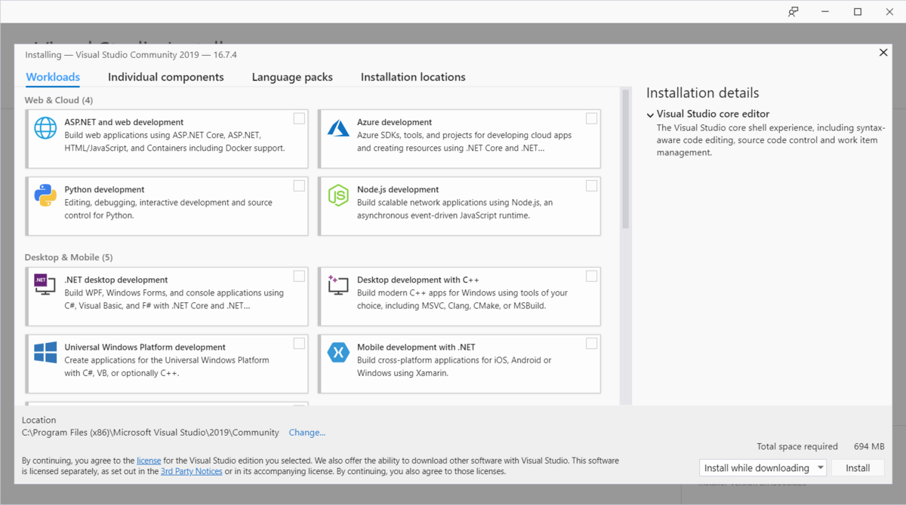
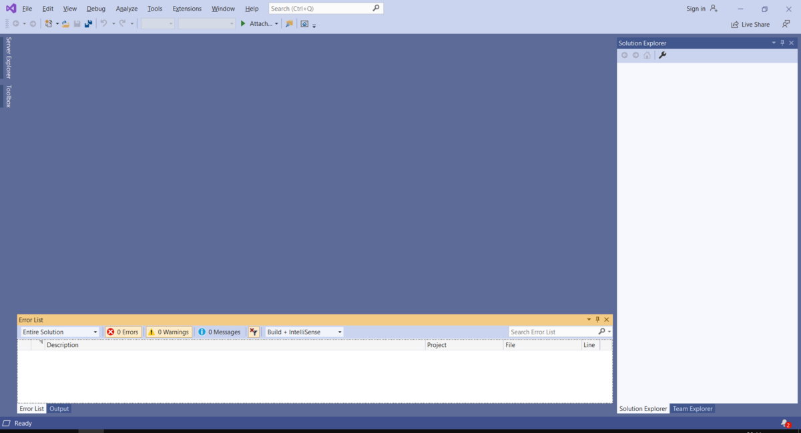
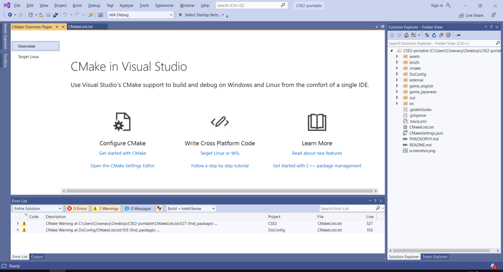
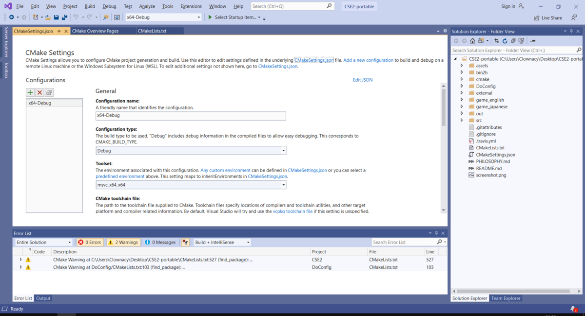

So you want to compile CSE2?

Well, to start, you'll need Visual Studio. I know a lot of people
recommend MSYS2 instead, and while it is a lot more lightweight, it's
also way more complex, and outright broken in some places, which will
make compiling an absolute nightmare (I'm looking at you, Brotli).

So, we'll be using Visual Studio Community 2019. Don't worry - it's
free. You can download it here:

https://visualstudio.microsoft.com/

Once it's downloaded, run `vs_Community.exe`. Follow the installer until
you reach this menu:

Here, you'll want to select the 'Desktop development with C++' workload,
and then click 'Install'. Once it's done installing, you'll be prompted
to restart your computer.

Next, download a copy of CSE2's source code if you haven't already and
extract it somewhere. You can find a copy of CSE2 Accurate's code here:

https://github.com/Clownacy/CSE2/archive/accurate.zip

You are now ready to compile CSE2. To begin, open Visual Studio 2019. If
it prompts you to open a project, select 'Continue without code' to skip
past it and enter the main IDE. It should look something like this:

From here, select `File/Open/CMake`, and then navigate to where you
extracted the CSE2 source code, and open the `CMakeLists.txt` file.

After this, Visual Studio will spend a few minutes configuring itself.
You can see all of this in the little text console at the bottom of the
window. Eventually, it will conclude, and hopefully not report any
errors. The window should now look something like this:

You are now able to produce 64-bit Debug builds of CSE2. To do so,
simply select `Build/Build All`. Like before, Visual Studio will spend
the next few minutes performing tasks, and reporting back in the text
console. It should eventually generate `CSE2_debug.exe` and
`DoConfig_debug.exe`, which you can find in CSE2's `game_english`
folder.

However, you probably want to be compiling Release builds, not Debug
builds. To do so, select the 'Open the CMake Settings Editor' option. It
will take you to this menu:

From here, change the 'Configuration type' option to 'Release'. You can
now rebuild CSE2, and the files `CSE2.exe` and `DoConfig.exe` will be
generated in the `game_english` folder.

And... that's it. If you want, you can edit CSE2's code by expanding the
`src` folder on the right, and selecting one of the various `.cpp`
files.
